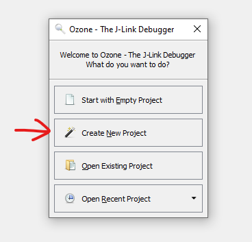
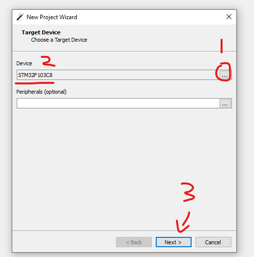
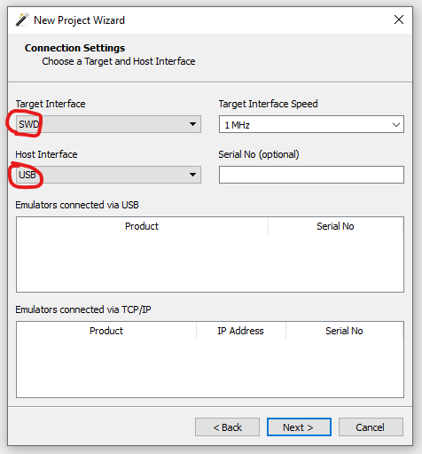
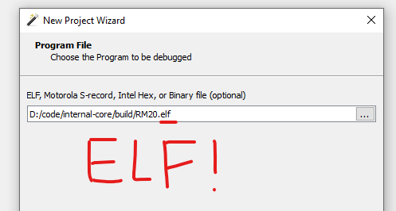
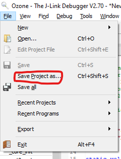
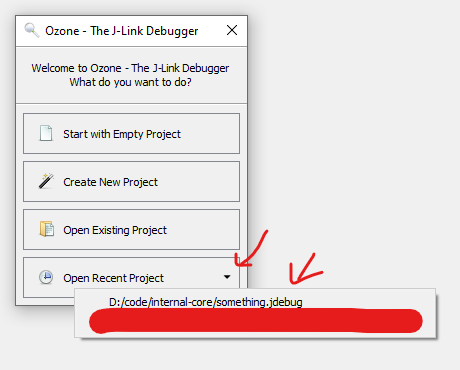

# Module 3 & 4 Assignment: A simple motor driver!
In this assignment, you will develop a __simple driver__ for controlling servo motor (MG996R). Don't worry about the complexity of writing a driver, we simpify a lot of things for you, you just need to implement few functions and be able to run your code! 
* For instructions on getting the code base, refer to [Code Base](#code-base)
* For instructions on writing your code, refer to [Implementing your code](#implementing-your-code)
* For instructions on compiling your code, refer to [Compiling your code](#compiling-your-code)
* For instructions on running your code, refer to [Running your code](#running-your-code)
* For hints and reference materials, refer to [Hints & Reference](#hints-and-reference)
* For submission guideline, refer to [Submission](#submission)
* For grading scheme, refer to [Grading](#grading)

## Code Base
* `git clone` this [repository](https://github.com/wlph17/RM-2020-BluePill) to acquire the generated code. 
* Then cut and paste the whole folder to your own repository (the one you handin your assignments) and work on it.
* Remember, you only need to modify two files: `WorkSpace/MG996R.cpp` and `Core/Src/UserTask.cpp`.

## Implementing Your Code
* You have only one goal: Able to control servo motor (i.e. to turn to any commanded angle within the controllable range).
* You will be using __PWM__ to control the servo motor, so please understand how to call HAL PWM APIs by going through the tutorials. (An example of PWM API that you will definitely use: `HAL_TIM_PWM_Start()`, try to find more to achieve your goal).

### Step 1
* Go to the `WorkSpace` folder of your code base, you'll se `MG996R.cpp` and `MG996R.hpp`
* Implement control functions, specifically, `void init()` and `void setTargetAngle(int8_t angle)` in `MG996R.cpp`. __DO NOT__ touch anything in `MG996R.hpp`.
* `void init()` should take care of the initialization, specifically, initializing your __Timer__ for __PWM signal output__.
* `void setTargetPosition(int8_t angle)` should take an target angle as input and command the servo motor to turn to that specific angle. (Hint: search for HAL PWM APIs to achieve that, also refer to MG996R datasheet in [Hints & Reference](#hints-and-reference), you need certain PWM signal for each angle).
* That's all you need to implement in `MG996R.cpp`. __THERE IS NO COMPLEX LOGIC__, it is very simple, as long as you undetstand __Timer__ and __PWM__, and know how to call the corresponding API, there is nothing hard for this task.

### Step 2
* Go to `Core/Src/` folder, you will see a file called `UserTask.cpp`, this file contains the __main control loop__. This is analogos to `int main()`.
* Create a __task function__ that calls your control codes, i.e. `init()` and `setTargetAngle()`. (Hint: There is already a __demo task function__, `blinky()`, try to learn from it).
* Then __create a task__ inside `startUserTask()`, if you watched the FreeRTOS tutorial, this should be simple and straightfoward. (Hint: use xTaskCreateStatic()!!!).

> Don't forget you have a namespace `MG996R`.

> You can add any helper functions you like, inside `WorkSpace/MG996R.cpp` and `Core/Src/UserTask.cpp`.

## Compiling Your Code
To compile your code, there are additional tool chains that you need to install beforehand, detailed instruction is included in the tutorial powerpoint.

* Please refer to the tutorial powerpoint in either OneDriver or Google driver.
* __REMEMBER TO READ THE INSTRUCTIONS CAREFULLY AND THOROUGHLY BEFORE YOU START INSTALLING YOUR TOOLCAHIN FOR COMPILATION!__

## Hints and Reference
* MG996R datasheet and control specification: https://components101.com/motors/mg996r-servo-motor-datasheet
* Hardware Timer Configuration: https://www.waveshare.com/wiki/STM32CubeMX_Tutorial_Series:_Basic_Timer
* PWM Generation: https://www.waveshare.com/wiki/STM32CubeMX_Tutorial_Series:_PWM
* `"tim.h"` is already included in your cpp file, so you have full access to HAL PWM library and APIs! 
* Use `HAL_StatusTypeDef HAL_TIM_PWM_Start(TIM_HandleTypeDef *htim, uint32_t Channel)` to initialize a specified timer channel for pwm generation
* `HAL_StatusTypeDef HAL_TIM_PWM_ConfigChannel(TIM_HandleTypeDef *htim, TIM_OC_InitTypeDef *sConfig,uint32_t Channel)` helps you to set the pulse width of your generated pwm signal. `*htim ` is the pointer to the timer handler instance generated by STM32 CUBEMX. `*sConfig` is what defines property of the PWM, check the definition of this struct to see how to use it.

> Note: Again, you need to go through tutorial modules 3 and 4 to gain sufficient background knowledge first (if you already know everything, as usual, feel free to skip those tutorials).

## Running Your Code
You can not actually run your code in your home (unless you have your own microcontroller and debugger). So you need to come to our lab to use the microcontrollers as well as the debugger, __THIS IS FOR OFFLINE PEOPLE__.

For __ONLINE__ people, we will open up zoom meeting rooms in which we will run your code for you so that you can see how your code performs and fix bugs if needed. For the details about the arrangement, please refer to [Submission](#submission)

### For OFFLINE people, please do the following things:
* Go to [this website](https://www.segger.com/downloads/jlink/#Ozone) to download Ozone. Scroll down and download the __J-LInk Software and Documentation Pack__, be careful, __DON'T__ download the beta version.
* Read [Usage of Ozone](#appendix-usage-of-ozone) at the end of this document to get a sense on how to use it.
* Later your will upload and run your code using Ozone when you come to our lab.

## Submission
### Online 
> Note: even if you are in HK, you can choose to be online, we are not forcing you to be offline student.

1. Push your code to the same repository that you have pushed your previous assignment to.
2. Notify us if you want to run your code (i.e. request for a test), so that we can download your code and prepare beforehand. __MAKE SURE YOU CAN COMPILE YOUR CODE FIRST__.
3. Join any zoom session starting __FROM THE NEXT DAY__ you requested a test. The time-slot for [zoom sessions](#online-test-session) are at the bottom most of this document
4. We will demonstrate your code running and see if it can actually control a servo motor, __IF YES__, then you are done. __IF NO__, we will give you hint where you did wrong and you need to figure out the bug and fix it (which means you need to request another test later).
5. Once we confirmed that your code works, you will revieve full mark for this assignment.

> Note: You have __UNLIMITED__ chances to test, but remember there is one day gap between you request a test and you can actually test.

### Offline
1. Come to our lab and test your code, we will give you debugger and microcontroller as well as servo motor.

> Note: You can even come to our lab to write your code and test any time you want.

2. Demo that your code works to any one of the senior in the lab, once we confirmed that, you will recieve __full marks__.
3. Push your code to your own repository (same as previous assignment), so that we can look at your implementation (just for reference).

## Grading
No actual grade for this assignment, its just pass or fail. If you cannot have a driver that controls servo motor before deadline, you will basically fail. 

> Remember, you can always seek help when you are stuck, although we are not going to tell you the answer, we still can give you hint and help with some confusions.

## Appendix Usage of Ozone
You won't be using this if you are __ONLINE student__. But it will be good if you can go through this as you will eventually be developing offline (before the competition).

### Creating New Project
1. Open Ozone  
2. 
3. 
4. 
5. 
6. Click the menu the save the project file for later usage:  
    

### Opening Old Project

## Online Test Session
Meeting room: [WILL BE RELEASED BEFORE OCT. 17th]    

Time-slots:
* MON. 1) 10:30 - 12:00 2) 14:00 - 15:30 3) 17:00 - 18:30 4) 20:00 - 21:30  
* TUE. 1) 10:30 - 12:00 2) 17:00 - 18:30 3) 20:00 - 21:30  
* WED. 1) 10:30 - 12:00 2) 14:00 - 15:30 3) 17:00 - 18:30 4) 20:00 - 21:30  
* THU. 1) 10:30 - 12:00 2) 17:00 - 18:30 3) 20:00 - 21:30  
* FRI. 1) 10:30 - 12:00 2) 14:00 - 15:30  
* SAT. 1) 10:30 - 12:00 2) 13:00 - 14:30 3) 16:00 - 17:30 4) 20:00 - 21:30  
* SAT. 1) 10:30 - 12:00 2) 13:00 - 14:30 3) 16:00 - 17:30 4) 20:00 - 21:30  

> Note: We will notify you through Wechat/Whatsapp beforehand if the sessions of any particular day will be cancelled. 
